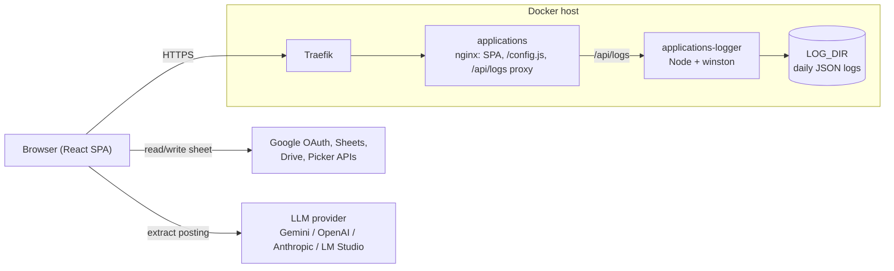

# Applications
A bring-your-own-data, bring-your-own-LLM job application tracker backed by your own Google Sheet.

## LM Studio Configuration
Self-hosted models are called straight from the browser. Nothing LLM-related is deployed with the app.

1. **Load the model:** in the **Developer** tab, load a chat model (7B+; smaller models often can't do structured output). In its load settings, set **Context Length** to 8192 or more, because the 2k/4k defaults cut off long postings. From the CLI: `lms load <model> --context-length 8192`.
2. **Start the server:** in the server settings, turn on **Enable CORS** and start the server.
3. **Connect the app:** in **Settings → AI Provider**, pick **Self-hosted (OpenAI-compatible)**, set the URL to `http://localhost:1234/v1/chat/completions`, then click **Discover** and pick the model.
4. **Leave the app's Structured Output toggle off.** The JSON schema is sent with every request as `response_format`.
5. **Check that the schema is enforced.** Run the command below. It should return `{"title": ...}`, not a poem:
   ```bash
   curl http://localhost:1234/v1/chat/completions -H "Content-Type: application/json" -d '{
     "model": "<model id>",
     "messages": [{"role": "user", "content": "Write a poem about the sea."}],
     "response_format": {"type": "json_schema", "json_schema": {"name": "test", "strict": true,
       "schema": {"type": "object", "properties": {"title": {"type": "string"}},
                  "required": ["title"], "additionalProperties": false}}}}'
   ```

## Key Features
- **Applications in your Google Sheet:** track applications, with status history stored in your own spreadsheet.
- **AI auto-fill:** fill the form from a pasted job posting with Gemini, OpenAI, Anthropic (via a CORS proxy) or any OpenAI-compatible server, with model discovery from the provider.
- **Analytics:** status and company breakdowns, a draggable pipeline Sankey, and a status timeline grouped by day, week or month.
- **Printable report** for any date range.
- **Server-side logging:** client logs are written to daily-rotated files by a log-sink container.

## System Design

Details on logging, LLM requests and the time series are in [`.claude/DESIGN.md`](.claude/DESIGN.md).

## Local Dev Prerequisites
- Node.js >= 22 and npm
- Docker Compose >= 2.0 (production only)
- A Google Cloud project with the **Sheets**, **Drive** and **Picker** APIs enabled, an OAuth client ID and an API key. If the key has referrer restrictions, the app's origin must be allowed, and it must also be listed as an authorized JavaScript origin on the OAuth client.

Install dependencies with `npm install`, plus `npm --prefix server install` for the log sink.

## Configuration & Environment Variables
Set these in `.env` (copy it from `.env.example`).

| Variable | Default | Notes |
| --- | --- | --- |
| `VITE_GOOGLE_CLIENT_ID` | — | **Required.** Baked into the bundle at build time |
| `VITE_GOOGLE_API_KEY` | — | **Required.** Baked into the bundle at build time |
| `DOMAIN` | `apply.whitney.rip` | Traefik host rule |
| `LOG_LEVEL` | `info` | `debug`/`info`/`warn`/`error`. Read at container start by both the client (via `/config.js`) and the sink |
| `LOG_DIR` | `/pwspool/software/applications/logs` | Host directory for log files |
| `LOG_RETENTION` | `30d` | Log files older than this are deleted |
| `LOG_ROTATE_FREQUENCY` | `1d` | How often a new log file is started |
| `LOG_CONSOLE_FORMAT` | `pretty` | `json` when a collector reads `docker logs` |

## Operational Runbook
```bash
# Local setup & development (http://127.0.0.1:5173)
git clone git@github.com:runyanjake/applications.git && cd applications
cp .env.example .env            # fill in the Google credentials
npm install
npm run dev
npm --prefix server install && npm run logs   # optional, second shell: log sink writing ./logs

# Linting & type-checking (no test suite yet)
npm run lint
npx tsc -b

# Production build & run (Jenkins runs the same steps, then health and smoke checks)
sudo mkdir -p /pwspool/software/applications/logs
docker build --target ci -t applications-ci .
docker compose up -d --build

# Common operations
docker logs -f applications-logger                                         # live log stream
tail -f /pwspool/software/applications/logs/applications-$(date -u +%F).log
jq -c 'select(.level == "error")' /pwspool/software/applications/logs/*.log
LOG_LEVEL=debug docker compose up -d                                        # change level, no rebuild
docker compose down
```
