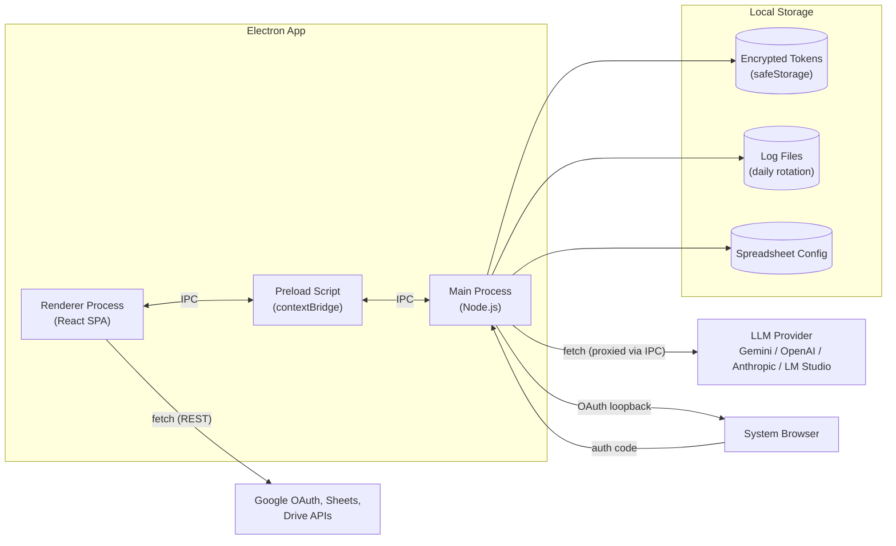

# Applications
A bring-your-own-data, bring-your-own-LLM job application tracker backed by your own Google Sheet—now as a native desktop app.

## Key Features
- **Applications in your Google Sheet:** track applications with status history stored in your own spreadsheet.
- **AI auto-fill:** fill the form from a pasted job posting with Gemini, OpenAI, Anthropic, or any OpenAI-compatible server (including local LLMs via LM Studio).
- **Analytics:** status and company breakdowns, a draggable pipeline Sankey, and a status timeline grouped by day, week, or month.
- **Printable report** for any date range.
- **Desktop-native:** runs as an Electron app with secure local token storage and file-based logging.

## System Design

```mermaid
flowchart LR
  subgraph electron["Electron App"]
    main["Main Process<br/>(Node.js)"]
    renderer["Renderer Process<br/>(React SPA)"]
    preload["Preload Script<br/>(contextBridge)"]
  end
  subgraph local["Local Storage"]
    tokens[("Encrypted Tokens<br/>(safeStorage)")]
    logs[("Log Files<br/>(daily rotation)")]
    config[("Spreadsheet Config")]
  end
  google["Google OAuth, Sheets,<br/>Drive APIs"]
  llm["LLM Provider<br/>Gemini / OpenAI / Anthropic / LM Studio"]
  browser["System Browser"]

  renderer <-->|IPC| preload <-->|IPC| main
  main --> tokens
  main --> logs
  main --> config
  main -->|OAuth loopback| browser -->|auth code| main
  renderer -->|"fetch (REST)"| google
  main -->|"fetch (proxied via IPC)"| llm
```
Details on architecture and data flow are in [`.claude/DESIGN.md`](.claude/DESIGN.md).

## Local Dev Prerequisites
- Node.js >= 22 and npm
- A Google Cloud project with the **Sheets** and **Drive** APIs enabled
- OAuth credentials:
  - OAuth 2.0 Client ID of type "Desktop app" (includes client secret)
  - OAuth consent screen with your account added as a test user

## Configuration & Environment Variables

Set these in `.env` (template: [`.env.example`](.env.example)). electron-vite inlines them into the build, so **rebuild or restart `npm run dev` after changing them**. Because the client secret ends up in `out/` and `dist/`, both are gitignored.

| Variable | Required | Notes |
| --- | --- | --- |
| `MAIN_VITE_GOOGLE_CLIENT_ID` | Yes | Desktop OAuth Client ID |
| `MAIN_VITE_GOOGLE_CLIENT_SECRET` | Yes | Desktop OAuth Client Secret |

## LM Studio Configuration
Self-hosted models are called from the app's main process. Nothing LLM-related is bundled with the application.

1. **Load the model:** in LM Studio's **Developer** tab, load a chat model (7B+). Set **Context Length** to 8192 or more. From CLI: `lms load <model> --context-length 8192`.
2. **Start the server.** CORS settings don't matter: requests come from the app's main process.
3. **Connect the app:** in **Settings → AI Provider**, pick **Self-hosted (OpenAI-compatible)**, set URL to `http://localhost:1234/v1/chat/completions`, click **Discover**, and select the model.
4. **Leave Structured Output toggle off.** The JSON schema is sent with every request as `response_format`.

## Operational Runbook

### Initial Setup
```bash
# Clone and install dependencies
git clone git@github.com:runyanjake/applications.git && cd applications
npm install
```

### GCP OAuth Setup
1. **APIs & Services → Library:** enable the **Google Sheets API** and **Google Drive API**.
2. **Google Auth Platform → Branding / Audience / Data Access:**
   - **User type:** External (or Internal on Workspace).
   - **Scopes:** `userinfo.email`, `userinfo.profile`, `.../auth/spreadsheets`, `.../auth/drive.readonly`.
   - **Test users:** add your Google account.
   - While the app is in **Testing**, refresh tokens expire after 7 days, so expect to sign in weekly. **Publish app** (unverified, with a warning screen and a 100-user cap) removes that limit.
3. **Clients → Create client:** type **Desktop app**. No redirect URIs are needed, because desktop clients accept any `http://127.0.0.1` loopback port (the app uses `8085`). Copy the Client ID and Client Secret.

### Development
```bash
# Configure credentials (see Configuration above)
cp .env.example .env

# Start Electron in development mode (hot reload for the renderer;
# restart after changing main/preload code or .env)
npm run dev
```

### Linting & Type Checking
```bash
npm run lint
npm run typecheck
```

### Building
```bash
# Compile main, preload and renderer into out/
npm run build

# Run the compiled build without packaging
npm run start

# Package for distribution (output in dist/)
npm run package           # current platform
npm run package:mac       # macOS (.dmg, .zip)
npm run package:win       # Windows (.exe, portable)
npm run package:linux     # Linux (.AppImage, .deb)
```

### Installing / Running the Packaged App (macOS)
```bash
# Run directly from the build output
open "dist/mac-arm64/Job Application Tracker.app"

# Or install: open the .dmg and drag the app to Applications
open dist/Job\ Application\ Tracker-*-arm64.dmg
```
The app is unsigned. Builds you make locally run without a Gatekeeper prompt. A copy downloaded or transferred from elsewhere must be opened once via right-click → **Open**. On first sign-in, macOS may ask for Keychain access; this is `safeStorage` encrypting the stored tokens.

### Common Operations
```bash
# View application logs (macOS)
tail -f ~/Library/Application\ Support/job-application-tracker/logs/app-$(date +%F).log

# View application logs (Linux)
tail -f ~/.config/job-application-tracker/logs/app-$(date +%F).log

# Clear stored credentials (macOS)
rm -rf ~/Library/Application\ Support/job-application-tracker/secure-data/

# Clear stored credentials (Linux)
rm -rf ~/.config/job-application-tracker/secure-data/

# Filter error logs
jq -c 'select(.level == "error")' ~/Library/Application\ Support/job-application-tracker/logs/*.log
```
